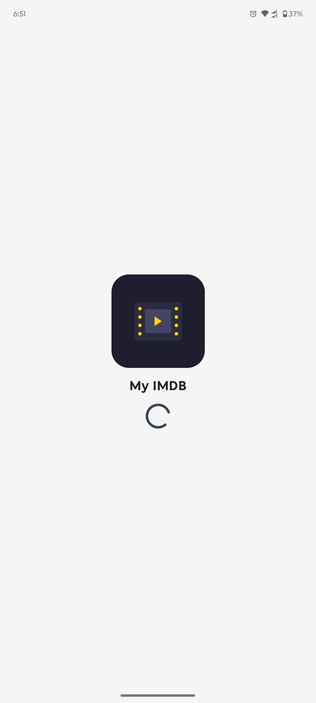
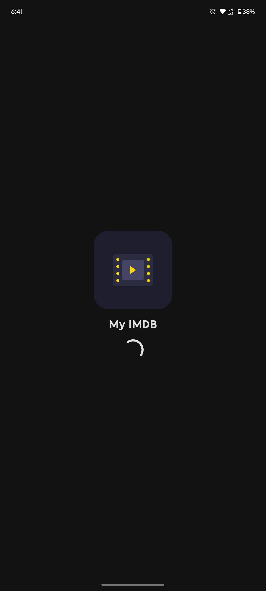
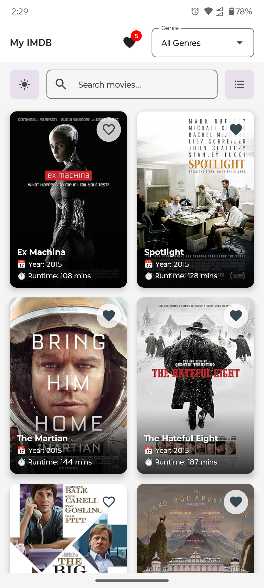
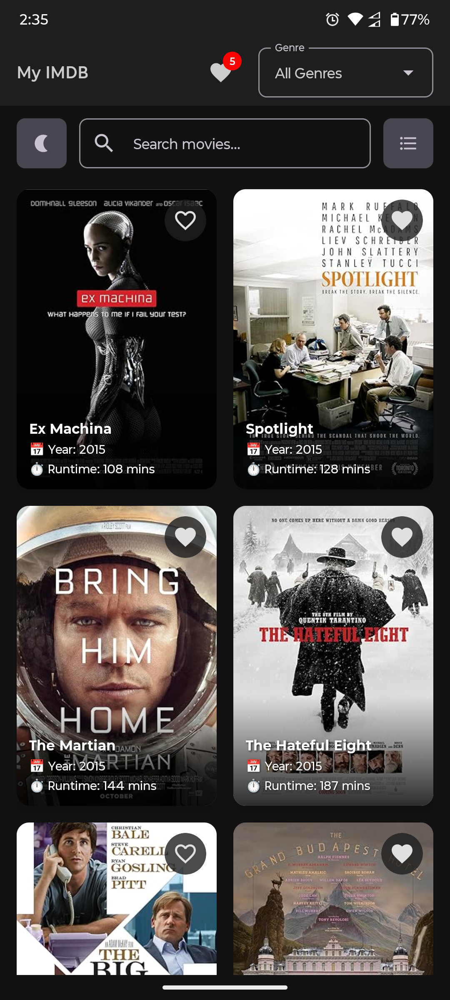
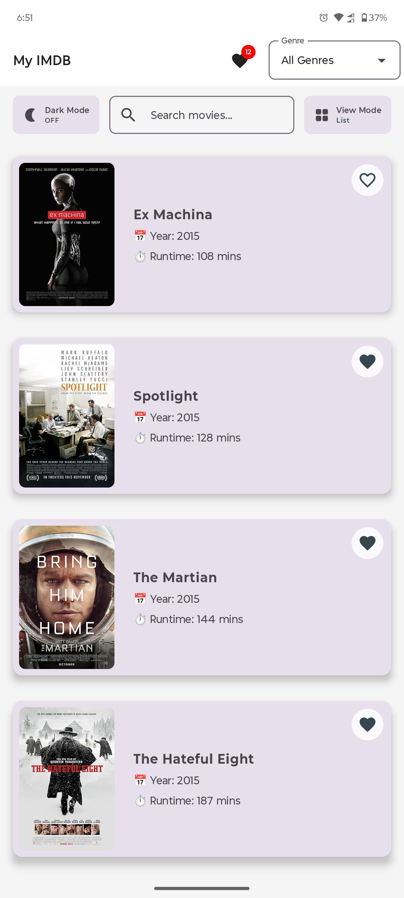
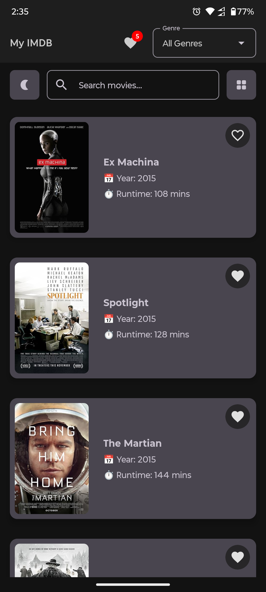
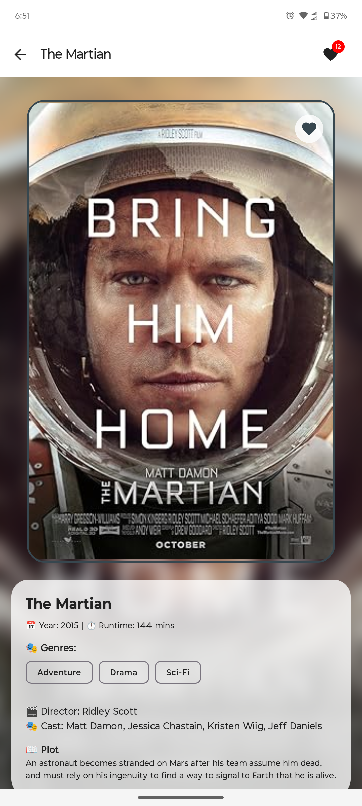
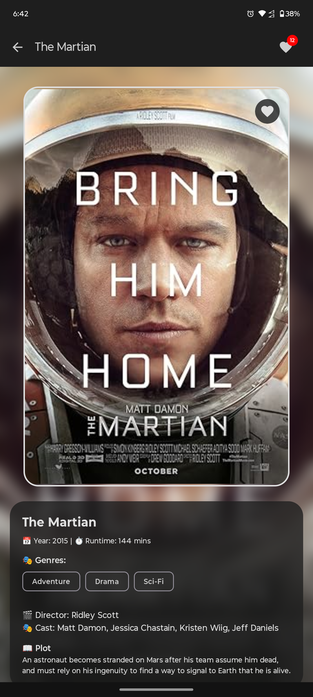
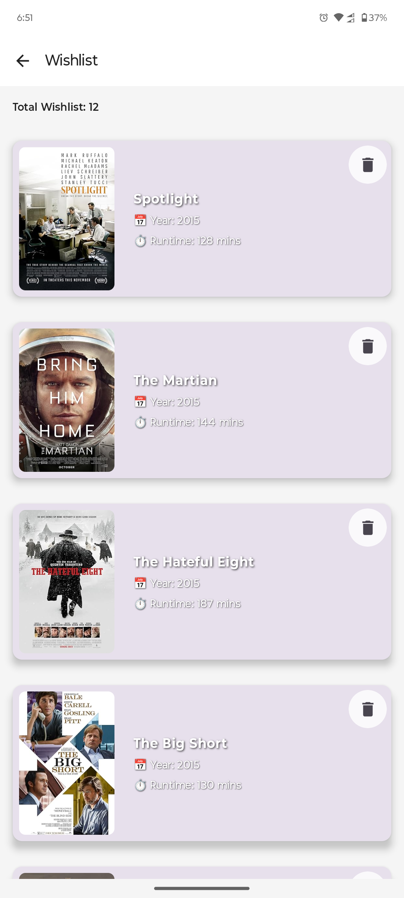
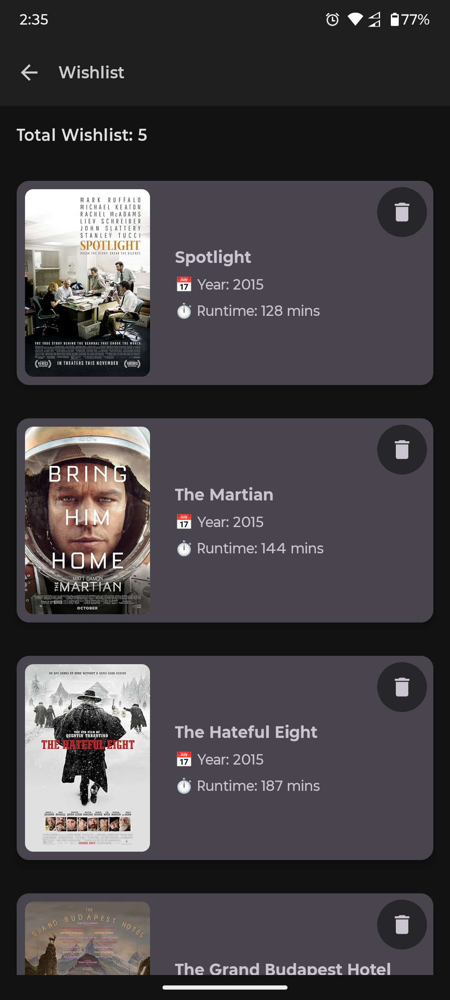

# 🎬 MyIMDB – Modern Movie App

A beautifully designed modern movie catalog app. Built with **Jetpack Compose**, this app emphasizes performance, offline support, user interaction, and a clean modular architecture.

---

## 📲 Download

- 🔗 [Download APK](https://github.com/maksudmubin/MyIMDB/releases/download/v1.0.0/MyIMDB.apk)  
- 📺 [Watch Demo Video](https://drive.google.com/file/d/1ny4S2-36xTqlk_7aiTSejnOu8RYx5b9p/view?usp=sharing)

---

## 🚀 Setup Instructions

1. **Clone the repository**
   ```bash
   git clone https://github.com/maksudmubin/MyIMDB.git
   cd MyIMDB
   ```

2. **Open in Android Studio (Narwhal Feature Drop | 2025.1.2 or later)**

3. **Build the project**

4. **Run on an emulator or physical device (API 24+)**

> ⚠️ Ensure you have a stable internet connection during the first app launch to sync the movie data.

---

## 🧰 Tech Stack

| Layer        | Technology                       |
|--------------|----------------------------------|
| Language     | Kotlin                           |
| UI           | Jetpack Compose (Material 3)     |
| Architecture | MVVM + Clean Architecture        |
| DI           | Hilt                             |
| Database     | Room                             |
| Network      | Retrofit + OkHttp                |
| Image Loader | Coil                             |
| State        | StateFlow + Kotlin Coroutines    |
| Modules      | Modularized by features and core |

---

## 🏗️ Project Architecture

```text
📦 MyIMDB/
├── :app                  // Main entry point, depends on :presentation and :data only
├── :presentation         // UI layer with ViewModels & Screens
├── :domain               // UseCases, pure domain models, and repository interfaces
├── :data                 // Repository implementations, DTOs, mappers, and DI aggregator module
├── :core:network         // Retrofit setup, network DTOs, interceptors, Retrofit-dependent DI module
├── :core:database        // Room DB config, DAOs, entities, database DI module
├── :core:common          // Shared pure Kotlin utilities, constants, result wrappers (no framework dependencies)
```

### 🔄 Data Flow

```
UI (Compose) 🔁 ViewModel (StateFlow) 🔁 UseCase (Domain) 🔁 Repository (Data) 🔁 [Remote (Network) + Local (Database)]
```

- **Domain Layer**: Business logic, interfaces, and models.
- **Data Layer**: Concrete implementations of repositories, data mapping between network, DB, and domain.
- **Presentation Layer**: Screens, UI events, effects, and state management.
- **Core Modules**: Shared resources used across multiple modules.

---

## ✨ Features

- ✅ **Offline-first experience** – One-time sync, then fully offline.
- 💖 **Wishlist** – Favorite movies and view separately.
- 🎭 **Genre filter** – Dropdown-based filter UI.
- 🔎 **Search** – Find movies by title.
- 🧮 **Pagination** – Local paginated movie list (10 per page).
- 🌗 **Dark/Light theme** – Toggle at runtime.
- 🗂️ **List/Grid toggle** – Switch between movie list styles.
- 🌀 **Smooth transitions & animations**

---

## 🖼️ Screenshots

> Place your images inside a `screenshots/` folder in the root directory. Below is the structure for both light and dark themes:

### 🧊 Splash Screen
| Light Mode                                    | Dark Mode                                   |
|-----------------------------------------------|---------------------------------------------|
|  |  |

### 🎬 Movie Grid Screen
| Light Mode                                      | Dark Mode                                     |
|-------------------------------------------------|-----------------------------------------------|
|  |  |

### 🎬 Movie List Screen
| Light Mode                                      | Dark Mode                                     |
|-------------------------------------------------|-----------------------------------------------|
|  |  |

### 🗃️ Movie Details Screen
| Light Mode                                            | Dark Mode                                           |
|-------------------------------------------------------|-----------------------------------------------------|
|  |  |

### 💖 Wishlist Screen
| Light Mode                                        | Dark Mode                                       |
|---------------------------------------------------|-------------------------------------------------|
|  |  |

---

## 🌐 API Source

Movie data is fetched once from a static JSON file hosted on GitHub:
- [`https://raw.githubusercontent.com/erik-sytnyk/movies-list/master/db.json`](https://raw.githubusercontent.com/erik-sytnyk/movies-list/master/db.json)

---

## 🛠️ Setup Instructions

```bash
# Clone the repo
git clone https://github.com/your-username/MyIMDB.git
cd MyIMDB

# Open in Android Studio Narwhal Feature Drop | 2025.1.2 or later
# Build and Run on API 24+ device or emulator
```

> 📌 The app will automatically fetch and cache movie data during the **first launch**.

---

## 🧾 License

This project is built for demonstration purposes. All movie data belongs to their respective owners.